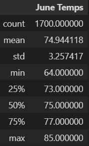
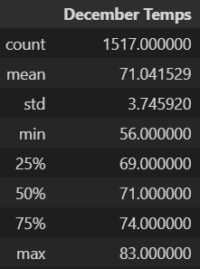
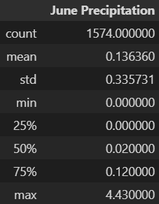
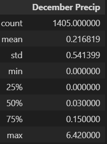

# Hawaii-Weather-Analysis
## Overview of Analysis
In this project, the temperatures in Oahu, Hawaii for the months of June and December was analyzed to gain insight for a business plan to open a surf shop.   
The data source for the temperature data is in the form of a SQLite file. The temperature data was obtained from multiple weather stations on a daily basis from January 2010 to August 2017. The SQLite file contained additional information regarding precipitation, the station at which the temperature data was gathered, and the date at which the data was gathered.   
SQLalchemy dependencies were employed to query the temperature data from the SQLite file. The temperature data for June and December that was queried was transformed into a Pandas dataframe and summary statistics were then gathered from the dataframes.  
## Results
**Table 1.** The summary statistics created in the table below apply to the dataframe that contains all temperature data for June.  
  
**Table 2.** The summary statistics created in the table below apply to the dataframe that contains all temperature data for June.  
  
* The average temperature in Oahu, Hawaii in June is 74.9 degrees fahrenheit. 
* The average temperature in Oahu, Hawaii in December is 71.0 degrees fahrenheit. 
* The hottest it gets in June is 85.0 degrees fahrenheit and the coldest it gets is 64.0 degrees fahrenheit.
* The hottest it gets in December is 83.0 degrees fahrenheit and the coldest it gets is 56.0 degrees fahrenheit.  
## Summary 
We can conclude that there is only a slight difference in the temperature in June and December and the weather during these months is ideal for the surf shop business since the the temperature is comfortable for surfing. More than half the time during June, it is over 75 degrees fahrenheit and more than half the time in December it is over 71 degrees fahrenheit. Some of the low temperatures also likely apply to the temperatures at night, but this is inconclusive since the data source did not provide a specific time in which the temperature data was acquired.   
Some additional information that can be queried from the SQLite data is the following:
* The precipitation summary statistics for June:  
  
* The precipitation summary statistics for December:  
  